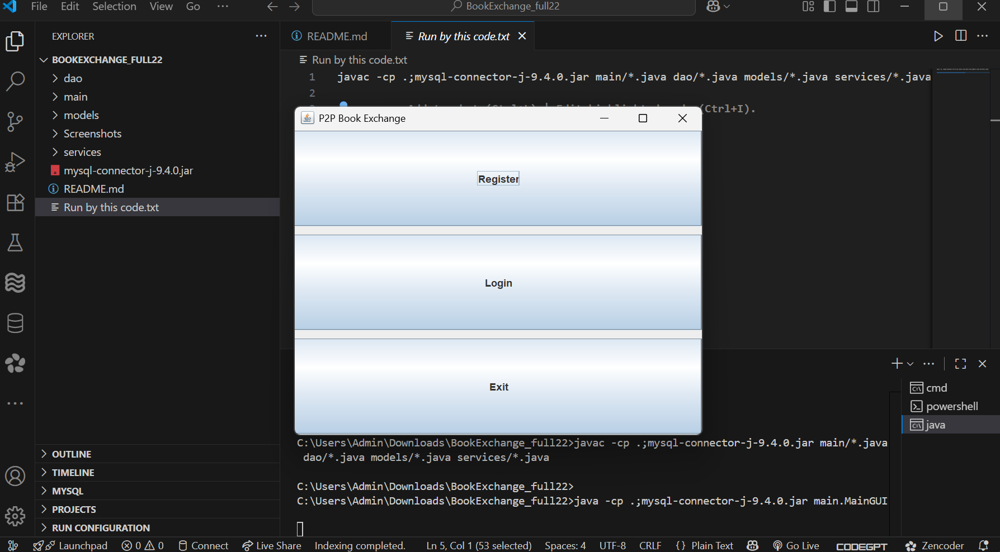
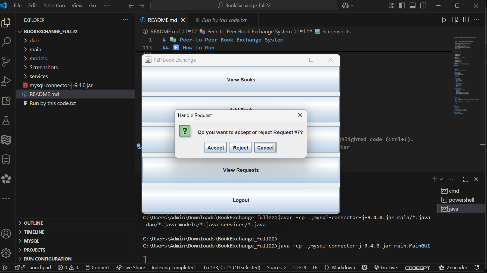

# 📚 Peer-to-Peer Book Exchange System

A Java Swing + MySQL desktop application that allows students to **register, add books, request exchanges, and manage book exchange requests** in a peer-to-peer manner.

---

## 🚀 Features

- **User Registration & Login**
  - Register new users with name, email, password, department, and year.
  - Secure login for existing users.

- **Book Management**
  - Add new books with title, author, category, and condition.
  - View all available books in the system.

- **Exchange Requests**
  - Request a book from another user by offering one of your own.
  - View incoming requests (requests received by you).
  - Accept or reject pending requests.
  - Accepted requests update the status of books accordingly.

- **Database-Backed**
  - MySQL is used to persist user, book, and request information.

---

## 🏗️ Project Structure

```
BOOKEXCHANGE_FULL22/
│
├── dao/                # Data Access Objects (database queries)
│   ├── DBConnection.java
│   ├── BookDAO.java
│   ├── RequestDAO.java
│   └── UserDAO.java
│
├── models/             # Entity models
│   ├── Book.java
│   ├── Request.java
│   └── User.java
│
├── services/           # Service layer (business logic)
│   ├── BookService.java
│   ├── ExchangeService.java
│   ├── RequestService.java
│   └── UserService.java
│
├── main/               # Application entry point (GUI)
│   └── MainGUI.java
│
├── mysql-connector-j-9.4.0.jar   # JDBC driver for MySQL
└── README.md
```

---

## ⚙️ Requirements

- Java 8+  
- MySQL Server  
- MySQL JDBC Driver (`mysql-connector-j-9.4.0.jar`)  

---

## 🗄️ Database Setup

1. Create a new database:
   ```sql
   CREATE DATABASE book_exchange;
   USE book_exchange;
   ```

2. Create tables:

   ```sql
   CREATE TABLE users (
       id INT AUTO_INCREMENT PRIMARY KEY,
       name VARCHAR(100),
       email VARCHAR(100) UNIQUE,
       password VARCHAR(100),
       department VARCHAR(50),
       year INT
   );

   CREATE TABLE books (
       id INT AUTO_INCREMENT PRIMARY KEY,
       title VARCHAR(100),
       author VARCHAR(100),
       category VARCHAR(50),
       book_condition VARCHAR(50),
       owner_id INT,
       FOREIGN KEY (owner_id) REFERENCES users(id)
   );

   CREATE TABLE requests (
       id INT AUTO_INCREMENT PRIMARY KEY,
       sender_id INT,
       receiver_id INT,
       book_requested INT,
       book_offered INT,
       status VARCHAR(20),
       FOREIGN KEY (sender_id) REFERENCES users(id),
       FOREIGN KEY (receiver_id) REFERENCES users(id),
       FOREIGN KEY (book_requested) REFERENCES books(id),
       FOREIGN KEY (book_offered) REFERENCES books(id)
   );
   ```

---

## ▶️ How to Run

1. **Compile the code**
   ```bash
   javac -cp .;mysql-connector-j-9.4.0.jar main/*.java dao/*.java models/*.java services/*.java
   ```

   (On Linux/Mac, replace `;` with `:` in the classpath.)

2. **Run the application**
   ```bash
   java -cp .;mysql-connector-j-9.4.0.jar main.MainGUI
   ```

---

## 🖼️ Screenshots

- **Login Screen**
- **Dashboard**
- **View Books**
- **Requests (Pending / Accepted / Rejected)**

*(Add your screenshots here for documentation)*
## 📸 Screenshots  

### 🔑 Login Screen  
  

### 🏠 Dashboard  
  

### 📚 View Books  
  

### 🔄 Requests (Pending / Accepted / Rejected)  
  

---

## 👨‍💻 Contributors

- Rakshihaa Sri GK
 (Panimalar Engineering College)

---

## 📜 License

This project is for educational purposes.
